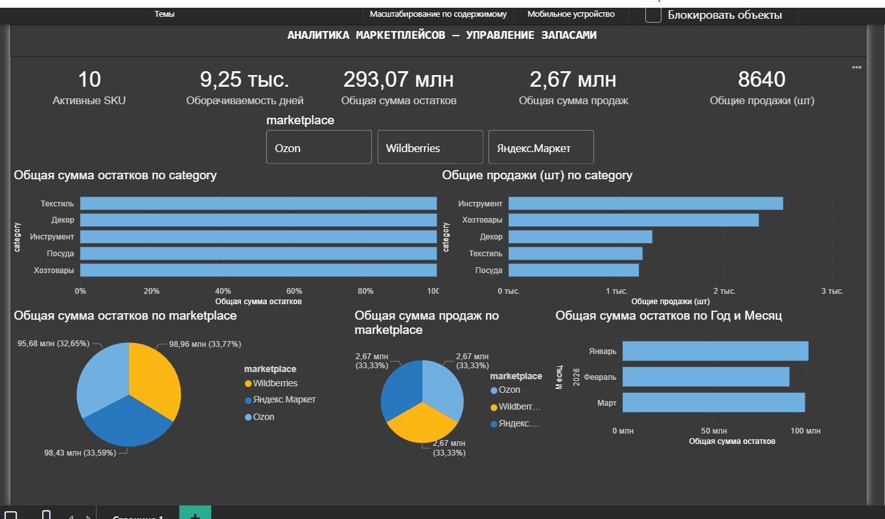

# Marketplace Analytics Dashboard — Аналитика маркетплейсов

## 📌 О проекте

Дашборд для анализа управления запасами на маркетплейсах (Wildberries, Ozon, Яндекс.Маркет). Проект демонстрирует навыки:

- **Анализ KPI** — расчёт ключевых метрик управления запасами
- **Визуализация** — круговые диаграммы, гистограммы, линейные графики
- **DAX** — создание мер для расчёта оборачиваемости, остатков, продаж
- **Интерактивность** — фильтры по маркетплейсам и категориям

## 📊 Ключевые метрики (KPI)

| Метрика | Значение |
|---------|----------|
| Активные SKU | 10 |
| Оборачиваемость | 9,25 тыс. дней |
| Сумма остатков | 293,07 млн руб |
| Сумма продаж | 2,67 млн руб |
| Продажи (шт) | 8 640 |

## 🔍 Аналитические выводы

- **Текстиль** — самая дорогая категория остатков (34% от всех запасов)
- **Инструмент** — лидер по продажам (40% выручки)
- **Оборачиваемость 9 250 дней** — критически низкая, товары продаются крайне медленно
- Запасы распределены равномерно между тремя маркетплейсами

## 💡 Рекомендации

1. Снизить закупки по категории «Текстиль»
2. Увеличить маркетинговую активность по категориям «Посуда» и «Декор»
3. Настроить автоматическое оповещение о товарах с оборачиваемостью > 90 дней

## 📸 Скриншот дашборда

## 🛠️ Используемые инструменты

| Инструмент | Назначение |
|------------|------------|
| **Power BI Desktop** | Создание дашборда |
| **Power Query** | Очистка и подготовка данных |
| **DAX** | Создание мер для KPI и аналитики |
| **PostgreSQL** | Хранение синтетических данных |

## 📞 Контакты

**Автор:** Сергей Петренко  
**GitHub:** [github.com/36ruSer](https://github.com/36ruSer)  
**Email:** 36ru@bk.ru
